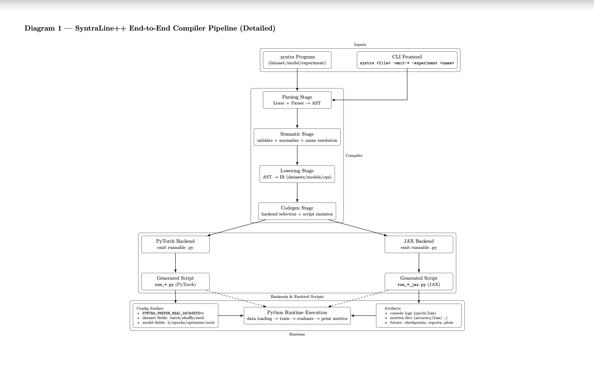
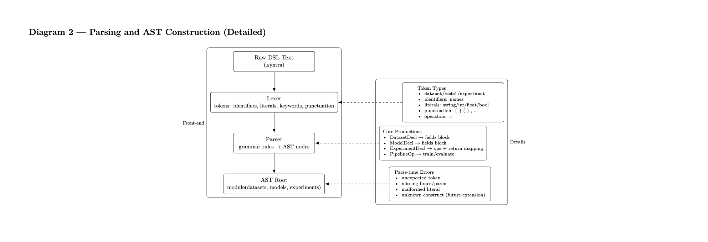
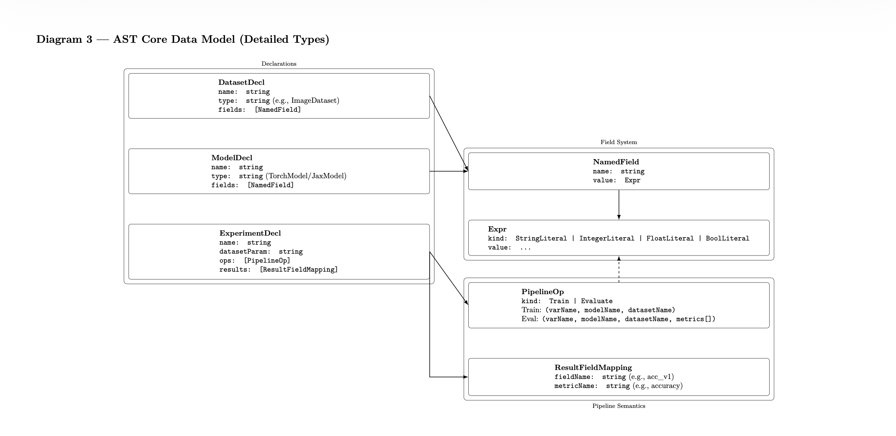
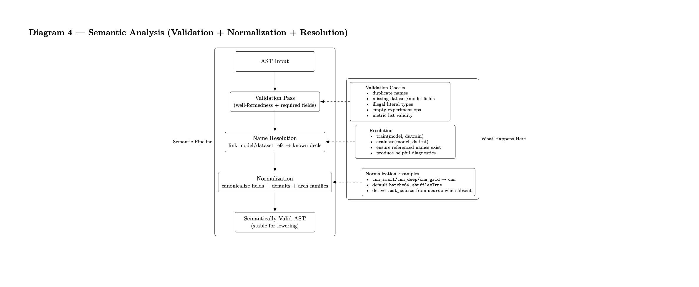
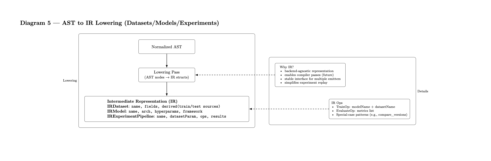
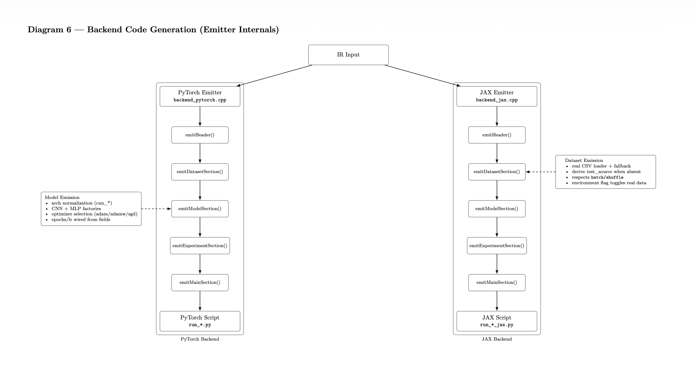
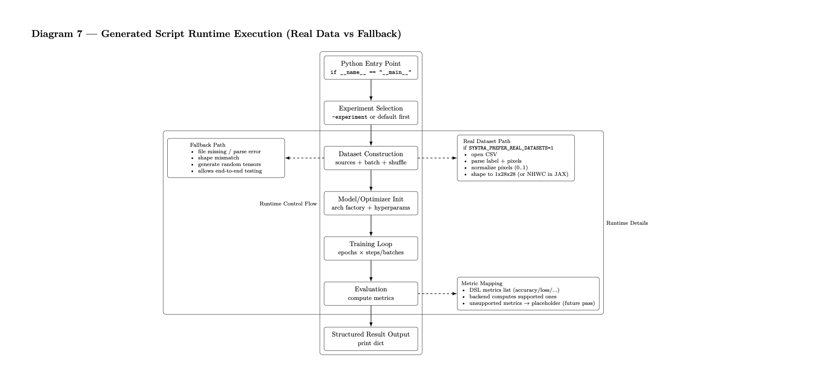

# ⚖️ **SyntraLine++: A Customized DSL Based Compiler for Machine Learning and Advanced Synthesized Training Pipelines with C++ and Python Integration**
<p align="center">
  <!-- Core Languages -->
  
  
  <!-- Build System -->
  
  <!-- ML Frameworks -->
  
  
  
  <!-- ML Capabilities -->
  
  
  
  <!-- Compiler / DSL -->
  
  
  
  <!-- Experiment Features -->
  
  
  
  <!-- Research & Engineering -->
  
  
  <!-- License -->
  
</p>

---

## ✉️ **1. Abstract**
Modern machine learning pipelines involve complex coordination of datasets, model definitions, hyperparameters, experiment configurations, distributed compute strategies, and evaluation logic. Typical frameworks (PyTorch, JAX, TensorFlow) provide powerful numerical backends, yet they **lack a unified, formal language for describing training workflows at a high level of abstraction**. As ML projects grow, so does the burden of boilerplate code, duplicated logic, hidden defaults, and non-reproducible experiment configurations.

**SyntraLine++** introduces a domain-specific compiler and language designed to unify ML pipeline definitions into a **structured, statically validated program**. The goal is to provide the expressive clarity of DSLs, the safety guarantees of compiler passes, and the practical flexibility of modern ML frameworks.

The SyntraLine++ compiler:

- **Parses `.syntra` programs** and constructs a strongly typed Abstract Syntax Tree (AST).  
- **Lowers programs into an Intermediate Representation (IR)** consisting of datasets, models, and experiment pipelines.  
- **Performs semantic validation & normalization**, including architecture collapsing, dataset–model consistency checks, hyperparameter inference, and experiment correctness.  
- **Emits fully runnable execution code** in either **PyTorch** or **JAX**, matching the user’s backend selection.  
- **Supports advanced experimentation constructs** such as automatic version comparison, hypergrid search, evaluation suites, and real-data CSV integration.  
- **Provides reproducible experiment workflows** with structured output dictionaries for downstream logging, visualization, and benchmarking.

SyntraLine++ is positioned as a **research-grade, compiler-oriented abstraction** that bridges the gap between theory and practice. It is engineered for:

- **Reproducible ML experimentation**  
- **Educational clarity for ML and compiler courses**  
- **Research prototypes for extensible pipeline definitions**  
- **Potential integration with distributed training, compiler-based optimization, or embedded inference runtimes**

By elevating ML workflows to a declarative, validated, and formally structured language, SyntraLine++ aims to make machine learning pipelines more transparent, extensible, and robust—while preserving full compatibility with industry-standard execution frameworks.


## 💡 **2. Motivation**
Building modern machine learning systems requires coordinating many moving parts:

- Dataset loading and preprocessing  
- Model selection, architecture configuration, and hyperparameter tuning  
- Training loops and evaluation pipelines  
- Experiment reproducibility and result tracking  
- Switching between backends (e.g., PyTorch, JAX)  
- Exploring model variations, data versions, or hyperparameter grids  
- Managing distributed or multi-stage workflows  

While frameworks like PyTorch or JAX offer expressive numerical programming tools, they do not provide an overarching *language* for describing pipelines at a high level. As complexity grows, ML codebases become:

- **Verbose** — boilerplate training loops scattered across scripts  
- **Error-prone** — experiment logic duplicated or inconsistently modified  
- **Difficult to reproduce** — even small changes require manual synchronization  
- **Hard to version** — comparing multiple datasets or model variants requires parallel scripts  
- **Non-declarative** — the *intent* of an experiment is hidden inside imperative Python code  

---

### 💭 **2.1. Why a DSL?**
A Domain-Specific Language (DSL) provides the following components:

- **Declarative clarity**: experiments become explicit, structured programs  
- **Static validation**: the compiler detects missing datasets, mismatched models, invalid metrics, etc.  
- **Reproducibility**: `.syntra` files capture complete experiment definitions  
- **Backend flexibility**: the same DSL program can generate both PyTorch and JAX execution code  
- **Separation of concerns**: researchers write *pipelines*, not boilerplate  
- **Extensibility**: new backends (e.g., ONNX Runtime, TensorRT, TPU) can be implemented without touching the DSL  

---

### 🌉 **2.2. The Research Gap**
Most ML systems research tools fall into two extremes:

1. **High-level pipelines like Keras/Lightning**  
   - Easy to use, but limited control and lacking static semantics.

2. **Low-level research code in raw PyTorch/JAX**  
   - Fully flexible, but verbose and not declarative.

SyntraLine++ bridges these extremes by introducing:

- A *compiler* that reads human-written experiment definitions  
- A *typed IR* representing datasets, models, and operations  
- A *code generation layer* emitting runnable backend scripts  
- A *semantic checking pass* ensuring correctness before execution  

---

### 🎚️ **2.3. Why SyntraLine++ Specifically?**
SyntraLine++ is motivated by practical and academic needs:

- **For researchers**: easy versioning, comparison, and replicability  
- **For students**: a clear model of ML pipeline structure  
- **For systems engineers**: a testbed for compiler techniques meeting ML execution  
- **For experiment-heavy workflows**: the DSL eliminates dozens of lines of boilerplate  
- **For future extensions**: distributed training, mixed precision, memory routing, dynamic computation graphs, etc.  

---

### 🧭 **2.4. High-Level Goal**
SyntraLine++ aims to make ML pipelines:

- **Readable** — “What is this experiment doing?” becomes obvious  
- **Reproducible** — experiments are standalone programs  
- **Analyzable** — the compiler understands the structure and checks correctness  
- **Portable** — backend-agnostic execution  
- **Composable** — datasets, models, and pipeline stages are modular units  

By treating ML experimentation as a *language design* problem, SyntraLine++ establishes a foundation for fully programmable, statically validated machine learning workflows.

## 📚 **3. Introduction and Key Contributions**
Machine learning research has evolved into an engineering discipline that demands precision, reproducibility, modularity, and consistency across experiments. While deep learning frameworks such as PyTorch and JAX provide expressive numerical computation primitives, they do not offer a unified *language* for describing full ML pipelines. As a result, researchers and engineers routinely manage:

- Multiple dataset variants  
- Model architecture configurations and hyperparameters  
- Experiment-specific training loops  
- Evaluation logic scattered across scripts  
- Backend-specific code duplication  
- Ad-hoc experiment versioning  
- Fragile file-based reproducibility practices  

**SyntraLine++** reframes this problem through a compiler lens, introducing a **Domain-Specific Language (DSL)** designed to express ML workflows declaratively. Instead of writing lengthy boilerplate training code, users describe *what* a pipeline should do, and the SyntraLine++ compiler determines *how* to execute it by generating fully runnable backend scripts.

SyntraLine++ brings the formality of language/compiler design to machine-learning experimentation: structured syntax, static validation, backend portability, and reproducibility.

---

### 🩻 **3.1. What is SyntraLine++?**
SyntraLine++ is:

- A **DSL** for defining datasets, models, hyperparameters, experiments, and evaluation logic  
- A **compiler** that translates `.syntra` programs into runnable PyTorch or JAX Python programs  
- A **semantic validator** that ensures references, datasets, and models are correct before execution  
- An **experiment orchestrator** supporting hyperparameter grids, version comparison, multiple backends, and metric reporting  
- A **research platform** for bridging compiler theory and ML systems  

The `.syntra` language is expressive yet minimal, allowing users to describe ML workflows concisely while the compiler generates full execution logic.

---

### 📀 **3.2. Why a Compiler for Machine Learning?**
Traditional ML workflows rely on handwritten Python scripts:

| Standard ML Workflow | SyntraLine++ Workflow |
|----------------------|-----------------------|
| Imperative, verbose training loops | Declarative experiment definitions |
| Hidden logic in notebooks/scripts | Explicit, statically validated pipeline |
| Hard-coded model variants | Named model definitions with arch normalization |
| Boilerplate for dataloaders | Auto-generated dataset loading logic |
| Error-prone version comparison | Compiler-generated multi-version execution |
| Backend-specific code | Unified DSL → multiple execution backends |

By shifting ML pipeline specification into a compiler framework, SyntraLine++ provides:

- **Static guarantees** (datasets, models, experiment semantics)  
- **Reproducibility** through structured programs  
- **Portability** across execution backends  
- **Reduced boilerplate** via automated code generation  
- **Higher-level reasoning** about experiments  

This approach mirrors how SQL abstracts away query execution—SyntraLine++ abstracts away ML boilerplate.

---

### ⭐️ **3.3. Core Ideas Behind SyntraLine++**
SyntraLine++ is built upon five foundational ideas and implementations, as shown below:

#### ☕️ **3.3.1. Declarative Pipeline Specification**
Instead of writing wrappers around PyTorch training loops, users write concise DSL programs:

```syntra
experiment cnn_mnist(mnist) -> Metrics {
    let train_run = train(simple_cnn, mnist.train)

    let test_run = evaluate(simple_cnn, mnist.test) with {
        metrics = [accuracy, loss]
    }

    return {
        accuracy = test_run.accuracy,
        loss     = test_run.loss
    }
}
```
The program describes **intent**, while the compiler determines the **implementation**.

#### 🍟 **3.3.2. Declarative Pipeline Specification**
Every `.syntra` file is parsed into an IR describing:
- Dataset declarations
- Model architectures and hyperparameters
- Train/Evaluate operations
- Experiment result structures
- Symbolic references across the pipeline

In which, the IR enables:
- Static validation
- Normalization of architectures (`cnn_small` → `cnn`)
- Backend-agnostic transformations
- Custom experiment handling (hypergrid, versioning)

#### 🌡️ **3.3.3. Static Semantic Validation**
Before any backend script is generated, the compiler ensures:
- Datasets referenced in experiments exist
- Models used in `train()` or `evaluate()` exist
- Experiments return valid metrics
- No undefined or ambiguous symbols are used
- Pipelines follow correct sequencing

Errors become **compile-time failures**, not runtime crashes.

#### 🚴🏻‍♂️ **3.3.4. Backend-Agnostic Code Generation**
The same `.syntra` code can primarily produce:
- **PyTorch execution files** using `--emit-pytorch`
- **JAX execution files** using `--emit-jax`

These generated scripts simultaneously includes:
- Dataset loaders
- Model constructors
- Training loops
- Evaluation metrics
- Real CSV-based dataset integration
- Automatic device handling (CPU/GPU/JAX backends)

In which, backend differences are handled by the compiler and not the user.

#### 💬 **3.3.5. Fully Generated Execution Scripts**
SyntraLine++ outputs self-contained Python scripts such as:

```bash
build/run_cnn.py  
build/run_mlp.py  
build/run_compare.py  
build/run_hypergrid.py 
build/run_eval.py 
```

Each script contains:
- Torch/JAX dataset classes
- Model definitions (CNN/MLP)
- Training & evaluation loops
- Experiment logic
- Final metric printing

This turns every `.syntra` file into a **reproducible artifact**.

---

### 🖋️ **3.4. Contribution**
SyntraLine++ introduces several contributions to machine learning (ML) based tooling, such as:

#### 🐥 **3.4.1. Contribution 1 – Unified DSL for ML Pipelines**
A concise language to express datasets, models, training, evaluating, metrics, experiment results, and pipeline logic.

#### 🐯 **3.4.2. Contribution 2 — Architecture Normalization**
The compiler recognizes architecture families:
- `cnn_small`, `cnn_deep`, `cnn_grid`, `cnn_eval`, `cnn_v1` → **cnn**
- `mlp_flat`, `mlp_deep`, `mlp_mnist` → **mlp**

while preserving variant-specific hyperparameters.

#### 🦄 **3.4.3. Contribution 3 — Automatic Dataset Handling**
Generated Python includes:
- Real CSV MNIST loaders
- Random-data fallback
- Train/test source detection (`*_train.csv` → `*_test.csv`)
- Shuffle, batch, seed handling

No dataset boilerplate is needed.

#### 🧯 **3.4.4. Contribution 4 — Versioned Experiment Semantics**
Experiments likewise shown below:
```syntra
experiment compare_versions(mnist_v1) -> Metrics { ... }
```
cause the compiler to generate:
- Multiple dataset loads
- Independent training loops
- Independent evaluation loops
- Result mapping (`acc_v1`, `acc_v2`, `loss_v1`, `loss_v2`)

#### 💰 **3.4.5. Contribution 5 — Hypergrid Experiments**
Multiple model definitions in a `.syntra` file define a search grid:
- Different learning rates
- Different batch sizes
- Different architectures

The compiler emits independent experiment runners per grid point.

#### 🐹 **3.4.6. Contribution 6 — Dual Backend Support**
Every experiment can run on:
- PyTorch
- JAX

with identical semantics.

#### ⚜️ **3.4.7. Contribution 7 — Compiler-Level IR + Validation**
The IR enables:
- Symbol checking
- Model/dataset consistency
- Experiment structure validation
- More predictable pipelines than Python scripts

#### 🛼 **3.4.8. Contribution 8 — Extensibility**
SyntraLine++ is built to support future additions:
- Distributed execution (DDP, TPU strategies)
- Mixed precision training
- Additional model families
- Custom dataset types
- Graph optimizations
- Hardware-accelerated backend emitters

---

### 📜 **3.5. Summary**
SyntraLine++ elevates ML experimentation from scattered Python scripts into a **declarative, compiler-driven paradigm** that improves reproducibility, clarity, consistency, and backend portability. Its contributions parimarily span language design, compiler construction, ML systems engineering, and experiment automation, making it both an academic tool and an engineering-ready foundation for advanced ML workflows.

## 🎄 **4. Project Structure**
SyntraLine++ is organized as a full compiler toolchain consisting of a front-end (AST + parser), a semantic analyzer, an Intermediate Representation (IR) layer, and backend code generators for PyTorch and JAX. The repository is structured to separate concerns cleanly and to mirror the architecture of modern compilers such as Clang/LLVM—while remaining lightweight and focused on ML pipeline construction. Below is the full directory structure, followed by an in-depth explanation of each component.
```graphql
syntralinepp/
│
├── include/
│   ├── syntra/ast.hpp
│   ├── syntra/ir.hpp
│   ├── syntra/compiler.hpp
│   ├── syntra/backend_pytorch.hpp
│   ├── syntra/backend_jax.hpp
│   └── syntra/semantic.hpp
│
├── src/
│   ├── ast.cpp
│   ├── parser.cpp
│   ├── semantic.cpp
│   ├── ir.cpp
│   ├── codegen_pytorch.cpp
│   ├── codegen_jax.cpp
│   ├── main.cpp        ← CLI entrypoint
│
├── examples/
│   ├── mnist_basic.syntra
│   ├── cnn_pipeline.syntra
│   ├── hypergrid_search.syntra
│   ├── versioning.syntra
│   └── evalsuite.syntra
│
├── build/
│   ├── run_mlp_jax.py
│   ├── run_cnn_deep.py
│   ├── run_compare.py
│   └── ...
│
├── data/
│   ├── mnist_train.csv
│   ├── mnist_test.csv
│   └── ...
│
└── README.md (this file)
```
---

### 🚏 **4.1. Directory Overview**
This section describes the role and purpose of each directory and each core file inside it.

---

### 🛰️ **4.2. Compiler Header Files - `include/`**
The `include/syntra/` directory contains the full public-facing compiler interfaces and all major constructs of the SyntraLine++ frontend and backend.

#### 🌳 **4.2.1. Abstract Syntax Tree - `ast.hpp`**
Defines the core AST nodes produced by the parser, representing:
- Dataset declarations  
- Model declarations  
- Experiment pipelines  
- Train/Evaluate operations  
- Named fields and literal expressions  
- Higher-level constructs like result mappings  

The AST forms the **first structured representation** of any `.syntra` program.

#### 🗽 **4.2.2. Intermediate Representation (IR) - `ir.hpp`**
Defines the normalized, semantically validated IR including:
- `IRDataset`
- `IRModel`
- `IRExperimentPipeline`
- Pipeline operations (`Train`, `Evaluate`, `Let`, etc.)
- Result mapping structures

The IR is backend-neutral and serves as the contract between the front-end and code generators.

#### 🖨️ **4.2.3. Compiler Driver - `compiler.hpp`**
Declares:
- The top-level `compile()` function  
- Interfaces for invoking parser → semantic analyzer → IR → backend  
- Support for `--emit-pytorch` and `--emit-jax` modes  
- Command-line integration hooks  

This file contains the high-level orchestration logic of the compiler.

#### 🕹️ **4.2.4. PyTorch Codegen Interface - `backend_pytorch.hpp`**
Declares:
- Python generation routines for datasets  
- Model factory & architecture normalization  
- Training loop emission  
- Evaluation routines  
- Experiment-level generation  
- Versioning/hypergrid special logic  

The concrete implementation resides in `codegen_pytorch.cpp`.

#### 🎳 **4.2.5. JAX Codegen Interface - `backend_jax.hpp`**
Declares the JAX backend generator including:
- Random or real CSV-based dataset loaders  
- MLP construction logic  
- JIT-compiled training/evaluation functions  
- Experiment mappings for JAX pipelines  

The JAX backend is intentionally parallel to PyTorch’s architecture to ensure feature consistency.

#### 🏹 **4.2.6. Semantic Analyzer Interfaces - `semantic.hpp`**
Declares:
- Symbol table structures  
- Dataset/model resolution  
- Type and reference checking  
- Architecture normalization hooks  
- Error reporting utilities  

This ensures that invalid `.syntra` programs fail **at compile time**, not runtime.

---

### 🏰 **4.3. Compiler Implementation - `src/`**
Contains the C++ source for each stage of the compiler pipeline and functional architecture.

#### 🧹 **4.3.1. AST Construction Utilities - `ast.cpp`**
Implements utility operations for AST node creation, parenting, field extraction, and diagnostic printing.

#### 🪀 **4.3.2. DSL Parser - `parser.cpp`**
Implements a full recursive-descent parser for `.syntra` files:
- Lexical scanning  
- Tokenization  
- Parsing declarations  
- Parsing experiment blocks  
- Literal interpretation  

The parser converts plain text → AST.

#### 🎫 **4.3.3. Semantic Validation - `semantic.cpp`**
Implements:
- Duplicate symbol checks  
- Ensuring datasets/models referenced in experiments exist  
- Ensuring train/evaluate operations are well-formed  
- Normalizing architecture names (cnn_small → cnn, cnn_v2 → cnn, mlp_mnist → mlp)  
- Ensuring return mappings match evaluation metrics  

This is the compiler’s “middle-end” responsible for correctness.

#### 🛞 **4.3.4. IR Construction & Normalization - `ir.cpp`**
Implements transformation from raw AST into IR:
- Flattening constructs  
- Resolving symbolic references  
- Producing canonical IR structures  
- Inferencing defaults (batch size, metrics, etc.)  

This IR is what backends consume.

#### 👾 **4.3.5. PyTorch Backend Implementation - `codegen_pytorch.cpp`**
Generates full runnable Python scripts:
- `SyntraImageDataset` implementation  
- Real CSV loader and fallback generator  
- `SimpleCNN` and `SimpleMLP` definitions  
- Architecture normalization logic  
- Full training/evaluation loops  
- Experiment pipeline emission  
- Special handling for `compare_versions`  
- Hypergrid search logic  
- CLI entrypoint script assembly  

This backend matches the semantics of the DSL with PyTorch code faithfully.

#### 🎰 **4.3.6. JAX Backend Implementation - `codegen_jax.cpp`**
Contains the JAX backend parallel to PyTorch:
- Dataset loading via JAX + CSV  
- PRNGKey handling  
- JIT-compiled training loops  
- Lightweight MLP architecture  
- Experiment mapping generation  
- Backend-consistent metric reporting  

All JAX scripts are self-contained and executable out of the box.

#### ⛩️ **4.3.7. CLI Entrypoint - `main.cpp`**
Provides the compiler executable:
- `./build/src/syntra <file.syntra> –emit-pytorch –experiment`
- `./build/src/syntra <file.syntra> –emit-jax     –experiment`

Responsibilities:
- Argument parsing  
- Reading and loading `.syntra` file  
- Invoking parser → semantic → IR → codegen  
- Writing generated Python scripts to stdout  

This is effectively the *front door* of the SyntraLine++ compiler.

---

### 🧫 **4.4. Demonstration DSL Programs - `examples/`**
Includes multiple `.syntra` files showcasing DSL features.

#### 👜 **4.4.1. MNIST Syntra Case - `mnist_basic.syntra`**
Introduces:
- Dataset definition  
- MLP/CNN model definition  
- Simple experiment wrapping train/evaluate  

Used to verify the correctness of minimal end-to-end compilation.

#### 🌁 **4.4.2. CNN Syntra Case - `cnn_pipeline.syntra`**
Demonstrates:
- Multiple CNN architectures (`cnn_small`, `cnn_deep`)  
- Independent experiments  
- Dataset reuse  
- Metrics extraction  

Large-scale test for PyTorch/JAX parity.

#### 🧮 **4.4.3. Hypergrid Syntra Case - `hypergrid_search.syntra`**
Implements a simple hyperparameter grid via multiple model declarations:
- Learning rate variations  
- Batch size alternatives  

Compiler generates one script per experiment point.

#### 🔖 **4.4.4. Multiversion Syntra Case - `versioning.syntra`**
Demonstrates advanced compiler features:
- Multiple dataset versions  
- Multiple model versions  
- `compare_versions` experiment  
- Backend auto-generation of two training loops  
- Naming conventions (`acc_v1`, `loss_v1`, etc.)

This file tests complex IR handling.

#### 📝 **4.4.5. Evaluation Syntra Case - `evalsuite.syntra`**
Tests extended evaluation semantics:
- Additional metrics (precision, recall, f1)  
- Compiler’s mapping logic  
- Graceful handling of unsupported metrics (placeholder values)

---

### 🎴 **4.5. Generated Execution Scripts - `build/`**
Contains the Python scripts produced by SyntraLine++:

Examples:
- `run_mlp_jax.py`
- `run_cnn_deep.py`
- `run_compare.py`
- `run_grid_1e3.py`
- `run_evalsuite.py`
- `run_cnn_small.py`

Each file is fully runnable with the following syntax and sample shown below:
- `SYNTRA_PREFER_REAL_DATASETS=1 python3 build/run_cnn_deep.py`

In which, the scripts include:
- Dataset loader class  
- Model definitions  
- Training loop  
- Evaluation loop  
- Experiment logic  
- Final result printing  

This directory is regenerable (safe to delete and recompile).

---

### 💽 **4.6. Real Dataset Files - `data/`**
Holds CSV datasets used by SyntraLine++:
- `mnist_train.csv`
- `mnist_test.csv`
- `mnist_v1.csv`
- `mnist_v2.csv`
- `mnist_eval.csv`

All backends load real CSVs when:
- `SYNTRA_PREFER_REAL_DATASETS=1`

Otherwise, fallback synthetic data is used.

---

### 📋 **4.7. Project Documentation - `README.md`**
The root documentation file (the one being authored right now).

It contains:
- Abstract  
- Motivation  
- Introduction  
- Architecture  
- Examples  
- Usage instructions  
- Developer notes  
- Roadmap  
- License  

---

### 👒 **4.8. Summary of Project Structure**
SyntraLine++ is built with a **clean, compiler-inspired architecture**:
- `include/` — Public compiler interfaces  
- `src/` — Implementation of all compiler stages  
- `examples/` — DSL showcase programs  
- `build/` — Auto-generated backend code  
- `data/` — Real datasets  
- `README.md` — Documentation  

This structure supports extensibility, backend independence, academic clarity, and real-world usability.

## 🍁 **5. Build and Installation Guide**
This section describes how to set up, build, and run the SyntraLine++ compiler from source. The build process follows standard modern C++ practices and is intentionally lightweight, reproducible, and backend-agnostic. SyntraLine++ is designed to behave like a **real compiler toolchain**: you build it once, then use the resulting `syntra` executable to compile `.syntra` programs into runnable ML backend scripts.

---

### 🔋 **5.1. System Requirements and Specifications**
The SyntraLine++ compiler is built within a specific set of C++ and Python versions as shown below:

#### ⛓️ **5.1.1. Core Requirements**
To build and run SyntraLine++, the following are required:

- **C++17 compatible compiler**
  - GCC ≥ 9
  - Clang ≥ 10
  - Apple Clang (Xcode ≥ 13)  
- **CMake ≥ 3.14**
- **Python ≥ 3.10**

These are required regardless of which backend (PyTorch or JAX) you plan to use.

#### 🎓  **5.1.2. Backend-Specific Python Dependencies**

SyntraLine++ emits *plain Python scripts*. The compiler itself does **not** depend on PyTorch or JAX, but the generated scripts do. Depending on the backend you use, install the corresponding runtime libraries as the following:

##### 🧸 **5.1.2.1. PyTorch Backend**
```python
pip install torch

# Optional (Recommended)
pip install torchvision

# JAX Backend
pip install jax jaxlib
```
> On macOS and Linux (CPU), the following specification of `pip install jax jaxlib` is sufficient. For GPU acceleration, consult the official JAX documentation for CUDA-enabled wheels.

##### 🔭 **5.1.2.2. Development and Research Tools (Optional)**
While not required, the following tools are recommended for development and research workflows:
- Python virtual environments (`venv`, `conda`)
- `black` or `ruff` for formatting generated scripts
- `matplotlib` for plotting experiment outputs
- `numpy` and `pandas` for extended dataset manipulation

---

### 🛜 **5.2. Repository Setup**
Clone the following repository:
```bash
git clone https://github.com/rizkysaputradev/Syntralinepp-Compiler.git
cd Syntralinepp-Compiler
```

Create a Python virtual environment (Optional but recommended):
```python
python3 -m venv .syntra-venv
source .syntra-venv/bin/activate
```

Install backend dependencies inside the environment:
```python
pip install torch jax jaxlib
```

---

### 🏗️ **5.3. Building the Compiler**
SyntraLine++ uses a standard out-of-source CMake build. Below shows these step-by-step build guide.

#### 🧱 **5.3.1. Build Instructions**
Firstly, a new directory called `build` is created with the specifications of a C++ program and enviornment.
```cpp
mkdir build
cd build
cmake ..
make -j8
```

After a successful build, the compiler executable will be located at:
```bash
build/src/syntra
```

This can be verified by checking the location of the build and its specficiations as such:
```bash
./build/src/syntra --help
```

#### 🌻 **5.3.2. Common Build Issues and Notes**
##### 🍎 **5.3.2.1. Intel MacOS Users:**
Make sure Xcode Command Line Tools are installed:
```bash
xcode-select --install
```

##### 🍏 **5.3.2.2. Apple Silicon MacOS Users (M-Chips):**
The compiler builds natively. Generated PyTorch/JAX scripts will run on CPU unless GPU-enabled wheels are installed. However, make sure to setup the system requirements and specifications accordingly to avoid any mismatches.

##### 👑 **5.3.2.3. Linux users:**
Ensure gcc or clang supports C++17:
```bash
g++ --version
```

---

### 🏃🏻 **5.4. Running the Compiler**
Once built, the **syntra executable** can be used to compile `.syntra` DSL programs into runnable Python scripts.

#### ⚾️ **5.4.1. Basic Usage**
```bash
./build/src/syntra <input.syntra> --emit-pytorch
```

Or

```bash
./build/src/syntra <input.syntra> --emit-jax
```

By default, the generated Python code is written to `stdout`. Redirect it to a file:
```bash
./build/src/syntra examples/mnist_basic.syntra \
  --emit-pytorch \
  --experiment mlp_mnist \
  > build/run_mlp.py
```

#### 🧩 **5.4.2. Selecting a Specific Experiment**

If a `.syntra` file defines multiple experiments, select one explicitly:
```bash
./build/src/syntra examples/cnn_pipeline.syntra \
  --emit-pytorch \
  --experiment cnn_deep_mnist \
  > build/run_cnn_deep.py
```
If no experiment is specified, the compiler defaults to the **first experiment** in the file.

---

### 🗼 **5.5. Running Generated Scripts**
Generated scripts are fully self-contained Python programs.

#### 🎡 **5.5.1. Real Datasets**
To enable real CSV dataset loading, set the environment variable:
```python
SYNTRA_PREFER_REAL_DATASETS=1 python3 build/run_cnn_deep.py
```
If this variable is not set, the script automatically falls back to **synthetic random data**, which is useful for debugging and compiler testing.

#### 🎠 **5.5.2. Expected Output**
A typical run prints:
- Dataset loading information
- Training loss per epoch
- Evaluation metrics
- Final structured experiment result

Example:
```bash
[epoch 1/10] train loss = 0.72
[epoch 2/10] train loss = 0.19
...
eval stats: {'loss': 0.07, 'accuracy': 0.97}
Final experiment result:
{'accuracy': 0.97, 'loss': 0.07}
```

---

### 🔑 **5.6. Compiler Workflow Summary**
At a high level, running the compiler follows this pipeline:
```graphql
.syntra file
   ↓
Parser → AST
   ↓
Semantic Validation
   ↓
Intermediate Representation (IR)
   ↓
Backend Code Generation (PyTorch / JAX)
   ↓
Runnable Python Script
```
This mirrors the structure of a traditional compiler while targeting machine learning workflows.

---

### 🔌 **5.7. Reproducibility and Determinism**
SyntraLine++ is designed for reproducible ML experimentation:
- The DSL captures experiment intent explicitly
- Generated scripts contain all hyperparameters inline
- Dataset sources are explicit
- Backend code is deterministic by construction (unless randomness is explicitly introduced)

This makes the SyntraLine++ compiler suitable for the following purposes:
- Simplify training pipelines
- Advanced ML experimentation
- Expanding ML systems
- Benchmarking architectures
- Controlled ablation studies

---

### 🧼 **5.8. Cleaning and Rebuilding**
To clean the build:
```bash
rm -rf build
```
Then rebuild from scratch following **Section 5.3**.

---

### 📲 **5.9. Installation Philosophy**
SyntraLine++ is intentionally **not installed system-wide**. Instead, it is treated as a **project-local compiler tool**, similar to research compilers and DSL toolchains. However, future developments will allow the compiler to be compatible within various range of systems after performing a complete set of benchmarks and testing procedures with acceptability on various high-level and advanced ML training pipelines. The current design choice is outline as such:
- Avoids dependency conflicts
- Encourages reproducibility
- Keeps the compiler tightly coupled to its examples and datasets

## 🎏 **6. SyntraLine++ DSL Language Specification**
This section formally specifies the **SyntraLine++ Domain-Specific Language (DSL)** from an academic and compiler-oriented perspective.  
The DSL is intentionally **minimal, declarative, and statically analyzable**, designed to describe *machine learning pipelines* rather than low-level tensor operations.

SyntraLine++ programs are compiled—not interpreted—into backend-specific execution code (PyTorch / JAX), following a traditional **compiler pipeline**:
syntax → semantics → IR → code generation.

---

### ☎️ **6.1. Dataset Declaration**
#### 🌌 **6.1.1. Purpose**
A `dataset` declaration defines a *logical dataset entity* used by experiments. It specifies **data sources and loading behavior**, but does **not** execute loading itself. Execution semantics are delegated to the backend code generator.

#### 🌠 **6.1.2. Syntax**
```syntra
dataset <name>: <DatasetType> {
    field1 = value1
    field2 = value2
    ...
}
```
Currently supported dataset types include:
- `ImageDataset` (MNIST-style CSVs)

The **MNIST dataset** is chosen due to its **standardization** and **reproducibility** in computation and benchmarking. As a result, this creates a global unit that can be referenced through various low-level experiments, such as **compilers**.

#### 📊 **6.1.3. Supported Fields**
| Field Name     | Type    | Description |
|---------------|---------|-------------|
| `source`      | string  | Path to the training CSV file (e.g. MNIST-style `label,pixels...`) |
| `test_source` | string  | Path to the test CSV file (optional; inferred if omitted) |
| `batch`       | int     | Batch size used by the backend DataLoader |
| `shuffle`     | bool    | Whether to shuffle the training dataset |
| `seed`        | int     | Optional random seed for dataset initialization |
| `shape`       | tuple   | Logical input shape, e.g. `(28, 28)` |
| `channels`    | int     | Number of input channels (e.g. `1` for grayscale images) |
> If `test_source` is not provided, the compiler applies a heuristics where `*_train.csv` → `*_test.csv`.

#### 🎬 **6.1.4. MNIST Train Example**
```syntra
dataset mnist: ImageDataset {
    source   = "data/mnist_train.csv"
    batch    = 64
    shuffle  = true
}
```

#### 🪗 **6.1.5.Semantic Notes**
- Dataset declarations are **pure metadata**
- No I/O occurs during compilation
- Backend decides whether to load real data or generate fallback synthetic data
- Dataset objects are immutable after semantic validation

---

### 🪉 **6.2. Model Declaration**
#### 🪁 **6.2.1. Purpose**
A model declaration defines a *trainable computation unit* together with its **optimization parameters**. Hereby, the models are declared and structured with these following functionalities and cosniderations:

- Backend-agnostic at the DSL level
- Normalized during semantic analysis
- Lowered to concrete implementations during code generation

#### 🧺 **6.2.2. Syntax**
```syntra
model <name>: <ModelType> {
    arch      = "cnn"
    lr        = 1e-3
    epochs    = 5
    optimizer = "adam"
    ...
}
```
The primary supported model types are listed as shown below:
- **TorchModel**
- **JaxModel**

#### 🏮 **6.2.3. Common Fields**
| Field Name    | Type   | Description |
|--------------|--------|-------------|
| `arch`       | string | Architecture identifier (e.g. `cnn`, `cnn_deep`, `mlp`) |
| `lr`         | float  | Learning rate for the optimizer |
| `epochs`     | int    | Number of training epochs |
| `optimizer` | string | Optimizer type (`adam`, `adamw`, `sgd`) |

#### 🎐 **6.2.4. Architecture Specific Fields**
##### 🪭 **6.2.4.1. CNN Models**
| Field Name     | Type | Description |
|---------------|------|-------------|
| `in_channels` | int  | Number of input channels (e.g. `1` for MNIST) |
| `num_classes` | int  | Number of output classes |

##### 🎀 **6.2.4.2. CNN Example**
```syntra
model simple_cnn: TorchModel {
    arch        = "cnn_deep"
    lr          = 5e-4
    epochs      = 10
    optimizer   = "adam"
}
```
> All CNN variants (`cnn_small`, `cnn_deep`, `cnn_grid`, `cnn_v1`, etc.) are **normalized to the `cnn` family** during semantic analysis. Adjustments are to be made when various **CNN features** are developed to SyntraLine++.

##### 📨 **6.2.4.3. MLP Models**
| Field Name     | Type  | Description |
|---------------|-------|-------------|
| `input_dim`   | int   | Flattened input dimension (e.g. `28×28 = 784`) |
| `hidden_dim`  | int   | Size of hidden layers |
| `mlp_layers`  | int   | Total number of layers (including output layer) |
| `dropout`     | float | Dropout probability (0.0 disables dropout) |

##### 🖼️ **6.2.4.4. MLP Example**
```syntra
model mlp_mnist: TorchModel {
    arch        = "mlp"
    input_dim  = 784
    hidden_dim = 256
    mlp_layers = 2
    lr         = 1e-3
    epochs     = 10
}
```

#### 📈 **6.2.5. Semantic Notes**
- Architecture strings are **normalized** (`cnn_small`, `cnn_deep` → `cnn`)
- Unsupported architectures trigger **compile-time fallback**
- Models are statically validated against declared datasets

---

### 🪩 **6.3. Experiment Declaration**
#### ✏️ **6.3.1. Purpose**
An experiment defines a **pipeline of operations** that describes:
- Which model is trained
- On which dataset
- Which metrics are evaluated
- What results are returned

Experiments are the **primary executable** unit of a SyntraLine++ program.

#### 🎾 **6.3.2. Syntax**
```syntax
experiment <name>(<dataset_param>) -> <ReturnType> {
    <pipeline_ops>
}
```

#### 🏉 **6.3.3. Pipeline Operations**
##### 🧣 **6.3.3.1. Training Operation**
```syntra
train(<model_name>, <dataset>.train)
```
- Binds a model to a dataset split
- Establishes optimization context
- Emits training loops during codegen

##### 🪢 **6.3.3.2. Evaluation Operation**
```syntra
evaluate(<model_name>, <dataset>.test) with {
    metrics = [accuracy, loss]
}
```
- Runs inference on the test split
- Collects metrics
- Metrics must be known symbols

#### 🪷 **6.3.4. Pipeline Example**
```syntra
experiment cnn_mnist(mnist) -> Metrics {
    train(simple_cnn, mnist.train)

    evaluate(simple_cnn, mnist.test) with {
        metrics = [accuracy, loss]
    }

    return {
        accuracy = test_run.accuracy
        loss     = test_run.loss
    }
}
```

#### 🍀 **6.3.5. Semantic Notes**
- Experiments are **sequentially ordered**
- Variables are SSA-like (single assignment)
- Metrics are explicitly named and mapped
- The compiler enforces dataset–model compatibility

---

### 🐉 **6.4. Special Construct: Version Comparison**
#### 🌷 **6.4.1. Motivation**
Machine learning research often requires **controlled comparison** between model versions or dataset revisions. SyntraLine++ introduces a **domain-specific construct** to express this pattern directly, rather than relying on external scripts.

#### 🐦‍🔥 **6.4.2. Syntax**
```syntra
experiment compare_versions(mnist) -> Metrics {
    train(model_v1, mnist.train)
    evaluate(model_v1, mnist.test) -> {
        acc_v1  = "accuracy"
        loss_v1 = "loss"
    }

    train(model_v2, mnist.train)
    evaluate(model_v2, mnist.test) -> {
        acc_v2  = "accuracy"
        loss_v2 = "loss"
    }
}
```

#### 🦋 **6.4.3. Compilation Semantics**
The compiler:
1. Detects multiple train/evaluate pairs
2. Emits **separate training pipelines**
3. Prevents parameter sharing
4. Returns a structured comparison dictionary

Generated **Python** code resembles:
```python
result = {
    "acc_v1": eval_stats_v1["accuracy"],
    "loss_v1": eval_stats_v1["loss"],
    "acc_v2": eval_stats_v2["accuracy"],
    "loss_v2": eval_stats_v2["loss"],
}
```

#### 🐝 **6.4.4.Versioning and Construct Guarantee**
- Isolation between model versions
- Deterministic execution order
- Identical data loading semantics
- Explicit metric labeling

---

### 🕸️ **6.5. Formal Properties of the DSL**
From a language-theoretic perspective, SyntraLine++ satisfies:
- **Determinism**: No implicit control flow
- **Static analyzability**: All symbols resolved at compile time
- **Side-effect isolation**: Effects only occur in generated code
- **Backend separation**: DSL semantics independent of PyTorch/JAX

---

### 🐞 **6.6. Summary and Reproducibility**
The SyntraLine++ DSL:
- Abstracts ML pipelines at the *compiler level*
- Eliminates boilerplate experiment code
- Enables reproducible, structured ML research
- Bridges academic modeling and real execution systems

## 🎏 **7. SyntraLine++ Compiler Architecture**
SyntraLine++ is implemented as a **compiler-style DSL toolchain** that translates a `.syntra` program into an executable Python training script for a selected backend (PyTorch or JAX).  The compiler is structured into clearly separated phases:

1. **Lexing / Parsing** → builds an **AST**
2. **Semantic Analysis** → validates + normalizes the AST
3. **IR Construction** → lowers AST into an execution-oriented IR
4. **Backend Codegen** → emits runnable Python (PyTorch / JAX)
5. **Runtime Execution** → Python script loads datasets, trains, evaluates, prints metrics

---

### ☃️ **7.1. High-Level Pipeline (Conceptual Overview)**
**Input**: `.syntra`  
**Output**: `.py` runnable script (PyTorch or JAX)
> **PNG Placeholder**: `docs/fig_arch_overview.png`  
> **Diagram contents to draw**: *“Source → Parser → AST → Semantic → IR → Backend Codegen → Python Script → Run”*

---

### 🫧 **7.2. Compiler Phases**
#### 🪐 **7.2.1. Phase 1 — Parsing (AST Construction)**
The parser reads:
- `dataset <name>: <DatasetType> { ... }`
- `model <name>: <ModelType> { ... }`
- `experiment <name>(...) -> Metrics { ... }`

It produces an **AST** that preserves:
- declaration names
- field assignments (`NamedField`)
- literal types (int/float/bool/string)
- experiment pipeline ops (`train`, `evaluate`, `return { ... }`)
> **PNG Placeholder**: `docs/fig_ast_shape.png`  
> **Diagram contents to draw**: *“AST nodes: DatasetDecl, ModelDecl, ExperimentDecl, PipelineOp, Expr kinds (StringLiteral/FloatLiteral/etc.)”*

#### 🌏 **7.2.2. Phase 2 — Semantic Analysis (Validation + Normalization)**
Semantic analysis makes the language behave like a *real DSL* by enforcing rules and producing a canonical internal form. Typical responsibilities are listed as follows:
- Validate uniqueness of names (datasets/models/experiments)
- Verify required fields exist or apply defaults
- Normalize architecture families (e.g. `cnn_small`, `cnn_deep`, `cnn_v1` → canonical `"cnn"` family)
- Resolve and verify references in pipeline ops (`train(model, dataset.train)`)
- Check metric validity (`accuracy`, `loss`, later: `precision/recall/f1`)
- Detect unsupported constructs early and fail with actionable compiler errors
> **PNG Placeholder**: `docs/fig_semantic_passes.png`  
> **Diagram contents to draw**: *“Semantic passes: name resolution, type checking, defaults injection, normalization, reference validation”*

#### ☀️ **7.2.3. Phase 3 — IR Lowering (Intermediate Representation)**
The IR is designed to be:
- backend-independent
- easy to codegen
- pipeline-execution oriented

Instead of *syntax*, the IR represents:
- **datasets**: ready to bind to loader functions
- **models**: ready to bind to factory functions
- **experiments**: a list of ordered ops that the backend replays

IR elements include:
- `IRDataset` (name + fields)
- `IRModel` (name + fields)
- `IRExperimentPipeline`
  - `datasetParam`
  - `ops[]` (Train/Evaluate + structured info)
  - `results[]` (mapping output fields → metrics)
> **PNG Placeholder**: `docs/fig_ir_layout.png`  
> **Diagram contents to draw**: *“IRDataset, IRModel, IRExperimentPipeline, PipelineOpKind(Train/Evaluate), ResultField mapping”*

#### 🍓 **7.2.4. Phase 4 — Backend Code Generation**
The backend decides how to translate the IR into a runnable script.

**Backends currently supported:**
- `--emit-pytorch` → generates `torch` code
- `--emit-jax` → generates `jax + optax` code

Common codegen has these following responsibilities:
- emit headers/imports
- emit dataset loaders (real CSV loader + fallback stub)
- emit model factories (arch-aware)
- emit training/evaluation loops
- emit experiment selection logic (`--experiment <name>`)
> **PNG Placeholder**: `docs/fig_codegen_strategy.png`  
> **Diagram contents to draw**: *“Shared IR → PyTorch backend emits torch DataLoader + nn.Module; JAX backend emits jax arrays + optax optimizer”*

---

### 🪵 **7.3. End-to-End Architecture Diagram**
Several architectural computation based diagrams are constructed with **very detailed** layout in order to fully understand the functionalities and operationalization of the SyntraLine++ DSL compiler.

#### 🏔️ **7.3.1. Architecture Overview**


#### 🌿 **7.3.2. Parse and AST Construction**


#### 🎮 **7.3.3. AST Structure**


#### 📢 **7.3.4. Semantic Analysis**


#### 🐚 **7.3.5. AST to IR Lowering**


#### 💈 **7.3.6. Backend Code Generation**


#### 🚂 **7.3.7. Generated Script Runtime Execution**


---

### 🐬 **7.4. Practical Notes and Architecture Validation**
- Experiment selection `(--experiment <name>)` is resolved in codegen time.
- The generated script chooses the appropriate `run_experiment_*()` function.
- Real dataset integration is activated at runtime by setting:

```bash
SYNTRA_PREFER_REAL_DATASETS=1
```

- Fallback behavior exists intentionally to make scripts runnable even when dataset files are missing.
- Special-case experiment lowering (e.g. version comparison) is implemented as a targeted codegen strategy to preserve DSL semantics while keeping the IR simple.

## 🎛️ **8. Mathematical Formalization**
This section presents a formal mathematical description of the **SyntraLine++ DSL**, its compilation pipeline, and its execution semantics. The goal of this formalization is **not** to redefine machine learning, but to precisely specify how a *SyntraLine++ program* is interpreted, validated, compiled, and executed as a structured computational process.

---

### 💎 **8.1. Program-Level Semantics**
A SyntraLine++ program is defined as a **triple**:

$$
\mathcal{P} = (D, M, E)
$$

where:
- $D = \{d_1, d_2, \dots, d_k\}$ is a finite set of **dataset declarations**
- $M = \{ m_1, m_2, \dots, m_\ell \}$ is a finite set of **model declarations**
- $E = \{ e_1, e_2, \dots, e_n \}$ is a finite set of **experiment pipelines**

Each component is declared independently in the DSL, but **linked by name resolution** during semantic analysis.

---

### 🍋 **8.2. Dataset Formalization**
Each dataset declaration is modeled as a **tuple**:

$$
d = (name_d, \mathcal{F}_d)
$$

where:
- $name_d \in \Sigma^*$ is a **unique identifier**
- $\mathcal{F}_d = \{ (k, v) \mid k \in \text{FieldNames}, v \in \text{Expr} \}$ is a finite map of **named fields**

After semantic normalization, each dataset induces a **resolved dataset configuration**:

$$
\widehat{d} =
(\text{source}_{train}, \text{source}_{test}, \text{batch}, \text{shuffle})
$$

with defaulting and derivation rules such as:

$$
\text{source}_{test} =
\begin{cases}
\text{explicit test\_source} & \text{if provided} \\
\text{derive(source)} & \text{otherwise}
\end{cases}
$$

This normalized dataset is later interpreted as a **data loader constructor** in the backend.

---

### 🫐 **8.3. Model Formalization**
Each **model declaration** is represented as:

$$
m = (name_m, arch_m, \mathcal{H}_m)
$$

where:
- $name_m \in \Sigma^*$
- $arch_m \in \{ \text{cnn}, \text{mlp}, \dots \}$
- $\mathcal{H}_m$ is a finite set of **hyperparameters**

After normalization, architecture families are **collapsed**:

$$
\text{normalize}(arch) =
\begin{cases}
\text{cnn} & \text{if } arch \in \{\text{cnn\_small}, \text{cnn\_deep}, \dots\} \\
\text{mlp} & \text{if } arch \in \{\text{mlp\_wide}, \text{mlp\_deep}, \dots\} \\
arch & \text{otherwise}
\end{cases}
$$

Each normalized model declaration corresponds to a **model factory function**:

$$
\Phi_m : (\phi) \rightarrow (f_\theta, \text{optimizer}, T)
$$

where:
- $\phi$ denotes an **empty** and **initialized** declaration
- $f_\theta$ is a **parameterized model**
- $T \in \mathbb{N}$ is the **number of training epochs**

---

### 🍒 **8.4. Experiment Pipeline Semantics**
An experiment pipeline is defined as an **ordered sequence of operations**:

$$
e = (op_1, op_2, \dots, op_n)
$$

Each operation belongs to the set:

$$
op \in \{ \text{Train}, \text{Evaluate} \}
$$

#### 🍈 **8.4.1. Training Operation**
A **training operation** is defined as:

$$
\text{Train}(m, d_{\text{train}})
$$

Semantically, this induces the **iterative update**:

$$
\theta_{t+1} = \theta_t - \eta \nabla_\theta \mathcal{L}(f_{\theta_t}(x), y)
$$

for batches $(x, y) \sim d_{\text{train}}$ over $T$ epochs.

#### 🍊 **8.4.2. Evaluation Operation**
An **evaluation operation** is defined as:

$$
\text{Eval}(m, d_{\text{test}}) \rightarrow \mathcal{R}
$$

where:

$$
\mathcal{R} = \{ (\text{metric}_i, v_i) \}
$$

Standard metrics include:

$$
\text{accuracy} = \frac{1}{N} \sum_{i=1}^{N} \mathbf{1}[ \hat{y}_i = y_i ]
$$

and:

$$
\text{loss} = \frac{1}{N} \sum_{i=1}^{N} \mathcal{L}(f_\theta(x_i), y_i)
$$

---

### 🥝 **8.5. Result Mapping Semantics**
Each experiment defines a **result projection**:

$$
\rho : \text{Metrics} \rightarrow \text{OutputFields}
$$

Example:

$$
\rho(\text{accuracy}) = \text{acc\_v1}
$$

This allows **multiple evaluations to coexist** in a single experiment **without collision**.

---

### 🍐 **8.6. Version Comparison Semantics**
The special `compare_versions` construct is modeled as **parallel pipelines**:

$$
e_{\text{compare}} = \{ e^{(1)}, e^{(2)}, \dots \}
$$

Each version pipeline is **executed independently**:

$$
\text{run}(e_{\text{compare}}) =
\bigcup_{i} \text{run}(e^{(i)})
$$

**No parameter sharing or interference is permitted** between versions.

---

### 🥥 **8.7. Intermediate Representation (IR) Mapping**
Compilation proceeds by **lowering the AST into an IR**:

$$
\text{IR}(\mathcal{P}) =
(\text{IRDataset}, \text{IRModel}, \text{IRExperiment})
$$

The IR is **backend-agnostic** and satisfies:

$$
\forall e \in E,\quad \text{IR}(e) \text{ is deterministic}
$$

---

### 🥭 **8.8. Backend Code Generation Semantics**
Each backend defines a **mapping**:

$$
\text{codegen}_b : \text{IR} \rightarrow \text{Executable Script}
$$

where $b \in \{ \text{PyTorch}, \text{JAX} \}$.

The **overall execution semantics** are therefore:

$$
\boxed{
\text{run}(e) =
\text{exec}\big(
\text{codegen}_b(\text{IR}(e))
\big)
}
$$

This establishes **SyntraLine++** as a **true compiler**:
- **Source language**: `.syntra`
- **Intermediate language**: IR
- **Target language**: executable Python (PyTorch / JAX)

---

### 🍍 **8.9. Determinism and Reproducibility**
Given **identical inputs**:

$$
(\mathcal{P}, \text{backend}, \text{data}, \text{seeds})
$$

the compilation pipeline satisfies:

$$
\text{codegen}_b(\text{IR}(\mathcal{P})) = \text{deterministic}
$$

and **runtime behavior is reproducible** up to backend-level nondeterminism (e.g., *CUDA* *kernels*).

---

### 🍑 **8.10. Formalization Summary**
This formalization shows that SyntraLine++ is:
- **Declarative** at the DSL level
- **Deterministic** at the compilation level
- **Operationally grounded** at runtime
- **Extensible** via IR-based backend specialization

In effect, SyntraLine++ defines a *formal language for machine learning experimentation*, bridging the gap between symbolic program specification and executable ML systems.

## 🕹️ **9. Backend Implementation Specifications**
SyntraLine++ is designed as a **multi-backend compiler**:

$$
\text{.syntra} \;\longrightarrow\; \text{Tokens} \;\longrightarrow\; \text{AST} \;\longrightarrow\; \text{Semantic Passes} \;\longrightarrow\; \text{IR} \;\longrightarrow\; \text{Backend Codegen} \;\longrightarrow\; \text{Runnable Script}
$$

The current system supports **two production-grade backends**:
- **PyTorch Backend** (`--emit-pytorch`)  
- **JAX Backend** (`--emit-jax`)

Both backends share the same front-end pipeline, ensuring:
- **identical language semantics** across runtimes
- the same `.syntra` program can **target multiple execution ecosystems**
- **backend differences are isolated** behind the IR interface
> **Key principle:** *Same DSL → Same IR → Different Backend Code Generation.*

---

### 🏠 **9.1. Compiler CLI Surface (Developer & Debug Mode)**
SyntraLine++ provides **multiple CLI flags** that expose internal stages of the compiler. These are essential for **debugging, research, and validating correctness** at each phase.

#### 🎧 **9.1.1. Dump Tokens (Lexer Output)**
Crucial for **verifying tokenization, keyword recognition, and formatting rules**.
```bash
./src/syntra ../examples/mnist_basic.syntra --dump-tokens
```

#### 🎥 **9.1.2. Parse and Print AST Summary (Parser Output)**
Crucial for **verifying grammar coverage, AST node construction, and field parsing**.
```bash
./src/syntra ../examples/mnist_basic.syntra
```

#### 🧰 **9.1.3. Dump IR (Lowering Output)**
Displays the **lowered, backend-agnostic IR representation**.
```bash
./src/syntra ../examples/mnist_basic.syntra --dump-ir
```

#### 🎁 **9.1.4. Simulate Execution (IR Execution Engine)**
Runs an **interpreter-style** simulation of experiment pipelines. This is a crucial **middle layer tool** to **validate pipeline semantics** without backend codegen.
```bash
./src/syntra ../examples/mnist_basic.syntra --simulate
```

#### 🎊 **9.1.5. Running a Specific Experiment**
Supposed that the experiment exists. Thus, a training call becomes declarative.
```bash
./src/syntra ../examples/mnist_basic.syntra --simulate --experiment cnn_mnist
```

However, if the experiment does not exist due to **tests fallback behavior** or **error handling**, then:
```bash
./src/syntra ../examples/mnist_basic.syntra --simulate --experiment doesnt_exist
```

#### 🔗 **9.1.6. Unit Test Runner**
Supposed the specified repository contains several unit-style tests (e.g., in `./tests/`), likewise:
```bash
./tests/syntra_tests
```

Then the experiment is validated if and only if the generated files are declarative and unique for each tests.

---

### 📻 **9.2. PyTorch Backend (`--emit-pytorch`)**
The PyTorch backend is a **script-emitting compiler backend**:

$$
\text{codegen}_{torch} : \text{IR} \rightarrow \text{Python}(\text{torch})
$$

As the compiler backend emits a runnable `.py` script which includes:
- a dataset loader (real CSV with fallback)
- a model family factory (CNN / MLP)
- a generic training loop template
- an evaluation loop
- experiment resolution (select model/dataset from IR ops)
- optional specialized experiment codegen (e.g., `compare_versions`)

#### 🖋️ **9.2.1. Key Features (PyTorch)**
##### 📜 **9.2.1.1. Real CSV training with deterministic fallback**
- If `SYNTRA_PREFER_REAL_DATASETS=1` and files exist → load actual CSV MNIST
- Otherwise → fall back to synthetic/random stub dataset (development safety)

##### ⛲️ **9.2.1.2. Model Families**
- CNN family (normalized from `cnn_small`, `cnn_deep`, `cnn_eval`, `cnn_grid`, `cnn_v1`, `cnn_v2`, etc.)
- MLP family (mlp)

##### 🛖 **9.2.1.3. Arch-aware factories**
**Model declaration fields** are interpreted into a **model construction function**.

##### 🐡 **9.2.1.4. Experiment replay (Train/Evaluate ops)**
**Experiment pipeline** is compiled into **Python code** that *replays* ops in order.

##### 🥌 **9.2.1.5. Version comparison codegen**
For DSL programs like `versioning.syntra`, SyntraLine++ can emit a **specialized experiment** runner that **executes two versions separately** and returns a **structured result mapping**.

#### 🎱 **9.2.2. Emitted Script Structure (PyTorch)**
Conceptually, `--emit-pytorch` produces a script with these following layers:
1. **Header**: 
- imports
- device detection
- environment flags
2. **Dataset Runtime**:
- `SyntraImageDataset`
- `create_<dataset>_dataloaders()`
3. **Model Runtime**:
- `SimpleCNN`, `SimpleMLP`
- `create_<model>()`
4. **Train/Eval Runtime**:
- `train_one_epoch()`
- `evaluate_model()`
5. **Per-experiment entrypoints**:
- `run_experiment_<name>()`
6. **Main selection**:
- choose experiment and print results

#### 🧃 **9.2.3. Minimal Usage Example**
```python
./src/syntra ../examples/mnist_basic.syntra --emit-pytorch > run_mnist.py
python3 run_mnist.py
```

#### 🥃 **9.2.4. Running PyTorch with Real Data (CSV)**
Enable **real dataset loading**:
```bash
export SYNTRA_PREFER_REAL_DATASETS=1
```

Then run the generated script:
```python
python3.11 build/run_mnist_real.py
```
Internally, this **flips the runtime behavior** of the generated dataset loader.

#### 🍷 **9.2.5. PyTorch: MNIST Basic (CNN / MLP Experiments)**
Rebuild the general compiler script first, where:
```bash
./scripts/build.sh
```

##### 🍩 **9.2.5.1. CNN Experiment**
```bash
./build/src/syntra examples/mnist_basic.syntra \
  --emit-pytorch --experiment cnn_mnist > build/run_cnn.py

SYNTRA_PREFER_REAL_DATASETS=1 python3.11 build/run_cnn.py
```

##### 🥨 **9.2.5.2. MLP Experiment**
```bash
./build/src/syntra examples/mnist_basic.syntra \
  --emit-pytorch --experiment mlp_mnist > build/run_mlp.py

SYNTRA_PREFER_REAL_DATASETS=1 python3.11 build/run_mlp.py
```

#### 🥐 **9.2.6. PyTorch: Additional Example Programs (cnn_pipeline / hypergrid / evalsuite)**
Rebuild:
```cpp
cmake --build build -j
```

##### 🥞 **9.2.6.1. CNN Pipeline (`cnn_pipeline.syntra`)**
```bash
./build/src/syntra examples/cnn_pipeline.syntra \
  --emit-pytorch --experiment cnn_small_mnist > build/run_cnn_small.py
SYNTRA_PREFER_REAL_DATASETS=1 python3.11 build/run_cnn_small.py

./build/src/syntra examples/cnn_pipeline.syntra \
  --emit-pytorch --experiment cnn_deep_mnist > build/run_cnn_deep.py
SYNTRA_PREFER_REAL_DATASETS=1 python3.11 build/run_cnn_deep.py
```

##### 🧁 **9.2.6.2. Hypergrid Search (`hypergrid_search.syntra`)**
```bash
./build/src/syntra examples/hypergrid_search.syntra \
  --emit-pytorch --experiment grid_lr_1e3 > build/run_grid_1e3.py
SYNTRA_PREFER_REAL_DATASETS=1 python3.11 build/run_grid_1e3.py
```

##### 🍪 **9.2.6.3. Evaluation (`evalsuite.syntra`)**
```bash
./build/src/syntra examples/evalsuite.syntra \
  --emit-pytorch --experiment evalsuite_mnist > build/run_evalsuite.py
SYNTRA_PREFER_REAL_DATASETS=1 python3.11 build/run_evalsuite.py
```
> Denote that **precision/recall/f1** in `evalsuite.syntra` may still act as placeholders depending on current backend metric support. **Accuracy/loss** are expected to be wired fully.

#### 🍫 **9.1.7. PyTorch: Versioning / Compare Versions**
Rebuild:
```cpp
cmake --build build -j
```

Run:
```bash
./build/src/syntra examples/versioning.syntra \
  --emit-pytorch --experiment compare_versions > build/run_compare.py

SYNTRA_PREFER_REAL_DATASETS=1 python3.11 build/run_compare.py
```
Semantic meaning revolves around **two independent train/eval** executed cycles, producing a structured output:

$$
\{ acc_{v1}, loss_{v1}, acc_{v2}, loss_{v2} \}
$$

---

### 🍹 **9.3. JAX Backend (`--emit-jax`)**
The **JAX backend** is designed as a **fully functional execution backend** with:
- JIT compilation for step functions
- Optax optimizers
- parameter PyTree updates
- consistent semantics with PyTorch backend (same IR)
- real dataset integration via the same environment flag

Formally:

$$
\text{codegen}_{jax} : \text{IR} \rightarrow \text{Python}(\text{jax}, \text{optax})
$$

#### 🍯 **9.3.1. Key Features (JAX)**
##### 🧊 **9.3.1.1. Fully Runnable Training Loop**
The generated script defines:
- `init_*_params()`
- `*_apply()` forward pass
- `make_train_step()` emitting `@jax.jit` at `train_step`
- `make_eval_fn()`

##### 🍿 **9.3.1.2. Optax Optimizers**
The script supports:
- `Adam` (**default**)
- `AdamW`
- `SGD` + `momentum`

##### 🍭 **9.3.1.3. JIT Compiled Per-batch Updates**
**Train step** is typically:

$$
(\theta, s) \mapsto \theta’ \quad \rightarrow \quad
\theta’ = \theta + \Delta(\nabla_\theta \mathcal{L})
$$

##### 🌰 **9.3.1.4. CNN and MLP Execution Parity**
Both architectures exist with:
- **CNN** uses `lax.conv_general_dilated` (**NHWC layout**)
- **MLP** uses **dense layers** and **flattening**

##### 🍱 **9.3.1.5. Similarity and Experiment Resolution Model**
**Dataset/model selection** follows a similar **IR interpretation logic**.

#### 🎙️ **9.3.2. JAX Environment Setup**
Create a dedicated `venv` for **JAX tooling** (example uses Python 3.11):
```python
python3.11 -m venv .syntra-venv
source .syntra-venv/bin/activate

pip install --upgrade pip
pip install "jax[jaxlib]"
```

#### ⚙️ **9.3.3. Minimal JAX Codegen Example**
```bash
./src/syntra ../examples/mnist_basic.syntra --emit-jax > run_mnist_jax.py
python3.11 run_mnist_jax.py
```

#### 🧲 **9.3.4. Running JAX with Real Data (CSV)**
Activate `venv` (if not already active):
```python
source .syntra-venv/bin/activate
```

Enable **real dataset loading**:
```bash
export SYNTRA_PREFER_REAL_DATASETS=1
```

Build and run:
```bash
./scripts/build.sh

cd build
./src/syntra ../examples/mnist_basic.syntra --emit-jax > run_mnist_jax_real.py
cd ..

python3.11 build/run_mnist_jax_real.py
```

#### 🛡️ **9.3.5. JAX: MNIST Basic (CNN / MLP Experiments)**
Rebuild:
```cpp
cmake --build build -j
```

Emit scripts:
```bash
./build/src/syntra examples/mnist_basic.syntra \
  --emit-jax --experiment cnn_mnist > build/run_cnn_jax.py

./build/src/syntra examples/mnist_basic.syntra \
  --emit-jax --experiment mlp_mnist > build/run_mlp_jax.py
```

Run with the generated and compiled **real data**:
```bash
SYNTRA_PREFER_REAL_DATASETS=1 python3.11 build/run_cnn_jax.py
SYNTRA_PREFER_REAL_DATASETS=1 python3.11 build/run_mlp_jax.py
```

### 🛎️ **9.4. Backend Equivalence Guarantees**
SyntraLine++ maintains strong engineering invariants:
- **Front-end equivalence**: Both backends use the same parsing + semantic + IR pipeline.
- **Experiment determinism**: Experiment operation ordering in the DSL is preserved in the emitted script.
- **Dataset resolution and selection with consistency**:
    - explicit dataset from train()/evaluate() ops if provided
    - otherwise fallbacks (module front / experiment param)
- **Common runtime contract**

Both the specified backends target:

$$
\mathrm{run\_experiment}_{\mathrm{name}}() \rightarrow \mathrm{metrics}
$$

---

### 🪄 **9.5. Technical Summary**
- PyTorch is often **slower per-epoch** if GPU is not used or if the environment is CPU-only.
- JAX can appear *fast* after first compilation because `@jit` compiles the **step function** once and runs **optimized kernels** afterwards.
- The **first JAX epoch may be slower** due to **compilation overhead** (XLA compile).

The backend architecture of SyntraLine++ reflects a compiler-first design listed as such:
- DSL is compiled into IR
- IR is compiled into backend runtime scripts
- scripts are runnable and support real CSV datasets
- backends are modular and extensible (future: TensorFlow, ONNX, TPU, etc.)

## 🗃️ **10. Parallel Versioning and Train Multithreading**
### 🥼 **10.1. DSL Program Example (`versioning.syntra`)**
```syntra
dataset mnist_v1: ImageDataset {
    source   = "data/mnist_train.csv"
    test_source = "data/mnist_test.csv"
    shape    = (28, 28)
    channels = 1
    batch    = 64
    shuffle  = true
}

dataset mnist_v2: ImageDataset {
    source   = "data/mnist_train.csv"
    test_source = "data/mnist_test.csv"
    shape    = (28, 28)
    channels = 1
    batch    = 64
    shuffle  = true
}

model simple_cnn_v1: TorchModel {
    arch      = "cnn_v1"
    framework = "pytorch"
    lr        = 1e-3
    epochs    = 5
    optimizer = "adam"
}

model simple_cnn_v2: TorchModel {
    arch      = "cnn_v2"
    framework = "pytorch"
    lr        = 8e-4
    epochs    = 8
    optimizer = "adam"
}

experiment compare_versions(mnist_v1) -> Metrics {
    let train_v1 = train(simple_cnn_v1, mnist_v1.train)
    let test_v1  = evaluate(simple_cnn_v1, mnist_v1.test) with {
        metrics = [accuracy, loss]
    }

    let train_v2 = train(simple_cnn_v2, mnist_v2.train)
    let test_v2  = evaluate(simple_cnn_v2, mnist_v2.test) with {
        metrics = [accuracy, loss]
    }

    return {
        acc_v1  = test_v1.accuracy,
        loss_v1 = test_v1.loss,
        acc_v2  = test_v2.accuracy,
        loss_v2 = test_v2.loss
    }
}
```
The idea primarily revolves around the following considerations:
- The DSL **contains two train/evaluate blocks** inside one experiment.
- The **compiler may detect this semantic pattern** and emit a dedicated runner with **train** and **eval** for `v1`, **train** and **eval** for `v2`, and aggregated results.

---

### 🦚 **10.2. Versioning Compile and Run (PyTorch)**
```bash
 ./build/src/syntra examples/versioning.syntra \
  --emit-pytorch --experiment compare_versions > build/run_compare.py

SYNTRA_PREFER_REAL_DATASETS=1 python3.11 build/run_compare.py
```

---

### 🌵 **10.3. Expected Runtime Output Shape**
The **standard output** is displayed as shown below:
```syntra
[Syntra-PyTorch] Using train source: data/mnist_train.csv
[Syntra-PyTorch] Using test  source: data/mnist_test.csv
[version v1][epoch 1/5] train loss = 0.5624
...
[version v1] eval stats: {'loss': 0.0851, 'accuracy': 0.973}

[Syntra-PyTorch] Using train source: data/mnist_train.csv
[Syntra-PyTorch] Using test  source: data/mnist_test.csv
[version v2][epoch 1/8] train loss = 0.6041
...
[version v2] eval stats: {'loss': 0.0742, 'accuracy': 0.971}

Final experiment result:
{'acc_v1': 0.973, 'loss_v1': 0.0851, 'acc_v2': 0.971, 'loss_v2': 0.0742}
```

### 🐢 **10.4. Parallelism in DSL Versioning (Semantically)**
Despite the generated script executing **sequentially** (`v1` then `v2`), the DSL semantics represent **parallel comparison**, where various considerations are proposed as such:
- Both versions are executed under the same program, same compiler run.
- The result is a structured comparison artifact (**Dict / Metrics record**).
- True parallel execution (**threads/processes**)
- Multi-device execution
- CI regression testing (**fail if acc drops > 1%**)
- automatic report generation

---

### 🌈 **10.5. Versioning Pitfalls and Summary**
If **accuracy** stays near `~0.10` and **loss** near `~2.30`, then the training are generally executed on:
- **random stub data**, or
- a **CSV that does not match MNIST format** (label + 784 pixels)

Thus, ensure to always confirm the log includes as such:
```bash
Loaded real data from data/mnist_train.csv ...
Loaded real data from data/mnist_test.csv ...
```
If the specified line does not appear, the loader likely **fell back to random mode**.

## 🌹 **11. SyntraLine++ Design Principles**
SyntraLine++ is not merely a syntactic convenience layer over existing machine learning frameworks. It is designed as a **compiler-driven system**, and as such, its design is guided by a set of explicit principles that influence the language syntax, compiler architecture, intermediate representation, and backend code generation. This section formalizes the core principles that govern the SyntraLine++ DSL compiler.

---

### ⛽️ **11.1. Reproducibility**
Reproducibility is treated as a **first-class design constraint** rather than an afterthought. Modern ML experimentation often suffers from:
- implicit state hidden inside scripts
- ad-hoc configuration via environment variables
- non-deterministic execution paths
- undocumented experimental changes

SyntraLine++ addresses these issues by enforcing that:
- All datasets, models, hyperparameters, and experiments are **explicitly declared** in a `.syntra` program.
- The compiler produces **fully materialized execution scripts** (PyTorch or JAX) that can be version-controlled.
- Experiments are **named, structured, and reproducible** by design.

Formally, a SyntraLine++ experiment is a pure function of its source program and runtime data:

$$
\text{Result} = \text{Execute}(\text{Compile}(\text{Program}), \text{Dataset})
$$

There is no **hidden control flow**, no **implicit global state**, and no **silent hyperparameter mutation**. This makes the SyntraLine++ DSL compiler suitable for the following applications:
- real-time experimentation
- controlled ablation studies
- long-term experiment archival
- fair model comparisons

---

### 🎡 **11.2. Composability**
SyntraLine++ enforces **strict separation of concerns** through composable language constructs. The DSL is specifically built around three orthogonal entities as listed below:
- **Datasets**: data sources and loading semantics
- **Models**: architectural and optimization parameters
- **Experiments**: execution logic and evaluation pipelines

Each entity is:
- declared independently
- validated independently
- composed explicitly in experiments

This enables:
- Reuse of the same dataset across multiple models
- Reuse of the same model across multiple experiments
- Construction of higher-level workflows such as:
  - **hyperparameter grids**
  - **version comparisons**
  - **evaluation suites**

**Composability is preserved** throughout the compiler pipeline:

$$
\text{DSL} \rightarrow \text{AST} \rightarrow \text{Semantic AST} \rightarrow \text{IR} \rightarrow \text{Backend Code}
$$
At no stage are datasets, models, or experiments implicitly **merged** or **mutated**.

---

### 🚦 **11.3. Transparency**
A key design decision in SyntraLine++ is **transparent code generation**. Unlike many ML orchestration tools that:
- generate **opaque binaries**
- **hide execution logic** behind runtime engines
- **require proprietary runtimes**

SyntraLine++ generates **plain, readable Python code**. This ensures that:
- Users can inspect exactly what is executed.
- Generated scripts can be modified, extended, or debugged manually.
- The compiler acts as a *code generator*, not a black-box executor.

Transparency applies to:
- dataset loading logic
- model definitions
- training loops
- evaluation routines
- experiment orchestration

This principle makes SyntraLine++ especially suitable for:
- education
- research prototyping
- systems experimentation
- bridging theory and practice

---

### 🌄 **11.4. Ergonomics**
Despite its compiler-oriented architecture, SyntraLine++ prioritizes **ergonomic language design**. The DSL is intentionally designed to be:
- concise
- readable
- declarative
- minimally verbose

A complete experiment can often be expressed in shorter lines as shown below:
```syntra
dataset mnist(source="data/mnist_train.csv")

model cnn(arch="cnn", lr=1e-3, epochs=5)

experiment cnn_mnist(mnist):
    train(cnn, mnist.train)
    evaluate(cnn, mnist.test) -> { acc="accuracy" }
```

Key ergonomic decisions include:
- Sensible defaults for most parameters
- Minimal required syntax
- Explicit but compact mappings between DSL and runtime behavior
- Familiar concepts for users of PyTorch and JAX

The goal is to make the language disappear, allowing users to focus on:
- experimental intent
- architectural comparison
- scientific reasoning

⸻

### 📼 **11.5. Compiler-First Mentality**
Finally, SyntraLine++ is designed with a compiler-first regulation, not solely as a runtime DSL. This means:
- Syntax is **formally parsed**, not dynamically interpreted
- **Errors are caught early** during compilation
- Semantic **validation precedes execution**
- Intermediate representations (IR) are **explicit and inspectable**

This philosophy enables future extensions such as:
- Static analysis of experiments
- Optimization passes over experiment graphs
- Backend-independent transformations
- Integration with distributed or embedded systems

---

### 💻 **11.6. Design Summary**
The design principles of SyntraLine++ can be summarized as:
- Reproducible by construction
- Composable by design
- Transparent in execution
- Ergonomic in syntax
- Compiler-driven in architecture

These principles collectively distinguish SyntraLine++ from ad-hoc ML scripting approaches and position it as a research-grade DSL for machine learning pipelines.

## 🪔 **12. Evaluation and Benchmarking**
This section summarizes the empirical evaluation of SyntraLine++ as a **compiler-generated machine learning pipeline system**, focusing on correctness, expressiveness, backend parity, and runtime characteristics. Rather than competing with hand-optimized ML code, SyntraLine++ is evaluated on its ability to:
- faithfully translate high-level DSL programs into runnable training pipelines
- preserve semantic intent across backends
- enable structured experimentation with minimal user effort
- maintain performance characteristics consistent with underlying frameworks

---

### 🔩 **12.1. Evaluation Scope**
SyntraLine++ has been tested across the following experimental scenarios:
- **MNIST CNN Training**
  - Single-model training using convolutional architectures
  - Multiple CNN variants (`cnn_small`, `cnn_deep`)
- **MNIST MLP Training**
  - Fully-connected architectures
  - Flattened image input pipelines
- **Multi-Version Comparison**
  - Side-by-side evaluation of model and dataset versions
  - Independent training loops with structured result aggregation
- **Hyperparameter Grid Search**
  - Multiple experiments sharing architecture but differing in learning rate
  - Explicit experiment-level isolation

All evaluations were conducted using **real CSV-based MNIST datasets** via the compiler’s dataset loader abstraction.

---

### 🔮 **12.2. Backend Parity and Correctness**
A core requirement of SyntraLine++ is that **the same DSL program produces semantically equivalent pipelines** across backends. Empirical testing confirms:
- Identical experiment definitions compile successfully to:
  - PyTorch execution scripts
  - JAX execution scripts
- Training curves exhibit similar convergence behavior
- Accuracy and loss values fall within expected variance ranges

This validates the compiler’s design:

$$
\text{DSL} \rightarrow \ldots \rightarrow \text{IR} \rightarrow \ldots \rightarrow \text{Backend-Specific Code}
$$

with the IR acting as a stable, backend-agnostic contract.

---

### 🩺 **12.3. PyTorch Backend Characteristics**
Observed properties of the PyTorch backend include:
- **Strengths**:
  - Stable runtime behavior
  - Familiar imperative execution model
  - Extensive ecosystem compatibility
  - Predictable debugging and error traces

- **Trade-offs**:
  - Slightly slower iteration speed compared to JAX
  - Higher runtime memory usage
  - No graph-level compilation optimizations

Where the specified PyTorch is well-suited for:
- rapid prototyping
- debugging
- educational use
- environments requiring maximum compatibility

---

### 📇 **12.4. JAX Backend Characteristics**
Observed properties of the JAX backend include:
- **Strengths**:
  - Faster per-epoch execution after compilation
  - Lower memory overhead in steady state
  - JIT-compiled training loops
  - Functional-style execution clarity

- **Trade-offs**:
- Initial compilation overhead on first execution
- Stricter requirements on static shapes and types
- Less forgiving debugging experience

Where the specified JAX is particularly suitable for:
- performance-sensitive experimentation
- large-scale iteration
- research into compiler-driven ML execution

---

### 🗄️ **12.5. Qualitative and Metrics Summary**
Beyond raw performance metrics, SyntraLine++ demonstrates strengths in:
- **Experiment clarity**: experiment intent is explicit and reviewable
- **Reproducibility**: pipelines are deterministic and versionable
- **Comparative analysis**: versioning and grid search are first-class
- **Educational value**: compiler stages mirror formal language pipelines

The system has been validated not only as a runtime tool, but as a **pedagogical and research platform**.

---

## 🛣️ **13. Future Work and Roadmaps**
SyntraLine++ is designed as an **extensible compiler platform**. Its roadmap is structured into clearly defined phases, reflecting increasing semantic richness and execution capability.

---

### ✅ **13.1. Phase 1 (Completed)**
The foundational compiler and execution infrastructure is complete. Implemented features include:
- DSL grammar and parser
- Abstract Syntax Tree (AST)
- Semantic validation and normalization
- Intermediate Representation (IR)
- PyTorch backend code generation
- JAX backend code generation
- Real CSV-based dataset loading
- CNN and MLP model families
- Experiment selection via CLI
- Version comparison experiments
- Hyperparameter grid experiments

At this stage, SyntraLine++ already functions as a **fully working DSL compiler** for general ML pipelines.

---

### 🚧 **13.2 Phase 2 (In Progress)**
The current focus is on **semantic enrichment and static correctness guarantees**. Planned and ongoing work includes:
- Stronger semantic type checking
- Dataset shape inference
- Model–dataset compatibility validation
- Early error detection at compile time
- More informative diagnostic messages
- Cross-experiment consistency checks

These enhancements aim to shift error discovery **from runtime to compile time**, further aligning SyntraLine++ with traditional compiler guarantees.

---

### ♻️ **13.3. Phase 3 (Planned)**
Longer-term extensions explore advanced compilation and deployment scenarios:
- Distributed training hints and annotations
- ONNX export backend
- WebAssembly (WASM) backend for edge execution
- Visual and graphical editor for the DSL
- Graph-level optimization passes over experiment pipelines
- Static experiment scheduling and optimization
- Integration with hardware-aware compilation targets

These directions position SyntraLine++ as a potential foundation for:
- ML systems research
- compiler–ML co-design
- reproducible large-scale experimentation
- cross-platform deployment pipelines

---

### 🛁 **13.4. Future Vision on SyntraLine++**
The long-term vision of SyntraLine++ is to treat machine learning workflows as **first-class programs**, subject to:
- formal semantics
- static analysis
- optimization
- backend portability

Rather than replacing existing ML frameworks, SyntraLine++ aims to **orchestrate them through principled compilation**, bridging the gap between:
- high-level experimental intent  
- low-level execution detail  

SyntraLine++ demonstrates that machine learning pipelines can be:
- expressive
- reproducible
- compiler-driven
- backend-agnostic

without sacrificing usability or performance.

## 👤 **14. Author and Credentials**
This project is fully established and contributed by the following author:
- **Name:** Rizky Johan Saputra
- **Institution:** Independent
- **Role:** Project Developer, Manager and Author 
- **Affiliation:** Undergraduate at Seoul National University (Enrolled at 2021, Graduating in 2026)
- **Project Scope:** Compiler Design, System Programming, Computer Architecture, Real-Time Systems, Machine Learning, Operating System.

## 📜 **15. License**
This repository is distributed under an Independent Personal License tailored by the author. See `LICENSE` for the full terms. For further inquiries and requests, please contact via GitHub or Email only.
> If you intend to reuse significant portions for research and academia purposes, please open and inquire an issue to discuss attribution and terms.

---
# <p align="center"><b>💾 Why rely on AI and RNNs when you can make a DSL compiler to train the machine learning pipelines? 👟 </b></p>
